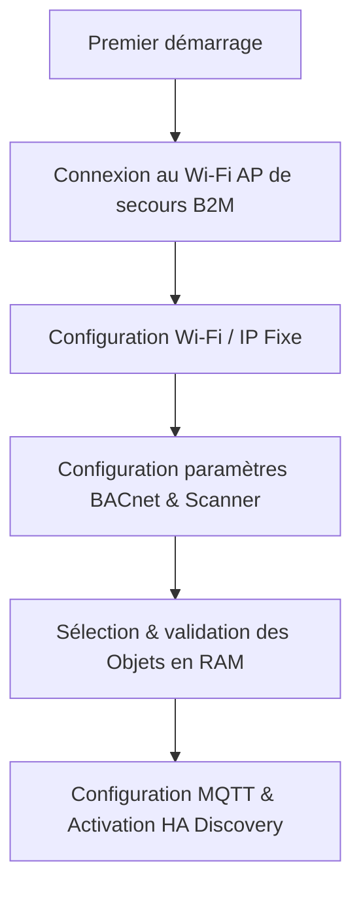

# Guide de Configuration de la Passerelle B2M

La passerelle BACnet2MQTT (B2M) stocke sa configuration de manière persistante dans la mémoire non-volatile (NVS) de l'ESP32.

---

## 🗺️ Processus d'installation recommandé

Pour installer proprement la passerelle sans spammer votre réseau, suivez cette séquence :



1.  **Démarrage initial (Mode Point d'Accès)** : Si aucun Wi-Fi n'est configuré ou détecté, la passerelle démarre son propre réseau Wi-Fi de secours (AP) nommé `BACnet2MQTT_XXXXXX`. Connectez-vous à ce réseau (pas de mot de passe par défaut) et accédez à `http://192.168.4.1`.
2.  **Configuration Réseau** : Via l'interface web, configurez le SSID, le mot de passe Wi-Fi et attribuez de préférence une adresse IP statique.
3.  **Configuration BACnet** : Configurez votre ID de Device local, le baudrate du bus MS/TP (ex: 38400 baud), la MAC address locale sur le bus, et lancez la découverte des équipements connectés.
4.  **Choix des Objets** : Activez ou désactivez le polling pour chaque objet découvert pour n'exposer que les entités nécessaires.
5.  **Configuration MQTT / Home Assistant** : Saisissez les identifiants de votre broker MQTT, puis activez la découverte automatique Home Assistant.

---

## 🛠️ Configuration par défaut (`src/z_config.h`)

Lors du premier démarrage, les constantes définies dans `src/z_config.h` initialisent la NVS. Pour une publication publique, ces constantes sont purifiées :

*   `DEFAULT_SSID` : Nom du Wi-Fi cible (`"YOUR_WIFI_SSID"`).
*   `DEFAULT_WIFI_PASS` : Clé de sécurité Wi-Fi (`"YOUR_WIFI_PASSWORD"`).
*   `DEFAULT_MQTT_SERVER` : Laissé **vide** (`""`) pour forcer une configuration explicite via l'UI avant connexion.
*   `DEFAULT_HA_DISCOVER` : Désactivé par défaut (`false`) pour un démarrage propre et contrôlé.

---

## 💾 Outils de Sauvegarde / Restauration (NVS)

Deux scripts Python dans le dossier `utils/` permettent de gérer la configuration à distance sans repasser par l'interface web :

*   **Sauvegarder la configuration** :
    ```bash
    python3 utils/nvs_backup.py --ip [IP_PASSERELLE] --user admin --pass [PASSWORD]
    ```
    Génère un fichier JSON local contenant tous les paramètres NVS (WiFi, MQTT, configuration des objets découverts).

*   **Restaurer la configuration** :
    ```bash
    python3 utils/nvs_restore.py --ip [IP_PASSERELLE] --user admin --pass [PASSWORD] --file [FICHIER_BACKUP.json]
    ```
    Réinjecte les paramètres sauvegardés dans l'ESP32 et redémarre la passerelle pour les appliquer.
